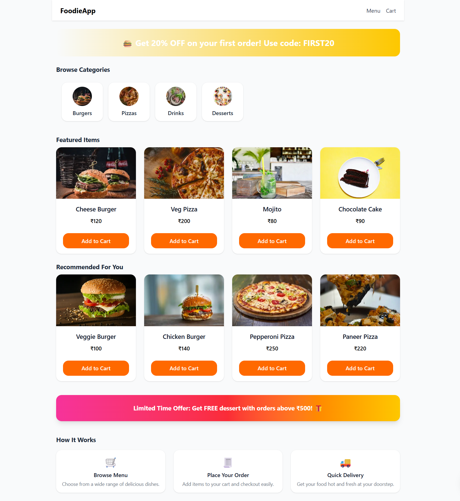

# 🍔 FoodieApp

A responsive, modern food delivery web app built with Next.js 15 (App Router), Redux Toolkit, and Tailwind CSS v4.

---

## 🚀 Setup Instructions

1. **Clone this repository:**

   ```bash
   git clone <your-repo-url>
   cd food-delivery-app
   ```

2. **Install dependencies:**

   ```bash
   npm install
   # or
   yarn install
   ```

3. **Run the development server:**

   ```bash
   npm run dev
   # or
   yarn dev
   ```

4. **Visit [http://localhost:3000](http://localhost:3000) in your browser.**

---

## ✨ Features

- **Responsive Design**: Mobile-first layout, adapts for desktop and tablet.
- **Dark/Light Theme Toggle**: Easily switch theme with the button (bottom right corner).
- **Homepage Sections**: Featured, Recommended, Categories, How It Works, and Special Offers.
- **Menu Page**: Filter food by categories; see grid of food items.
- **Add to Cart**: Add, remove, and update quantities for each food item.
- **Cart Page**: Shows all cart items, delivery charge (free above ₹500), GST, subtotal, and total.
- **Checkout Page**: Fill delivery form, review order summary, and place a dummy order.
- **Reusable Components**: Buttons, Quantity Selectors, Food Cards, Input Fields, Skeleton loaders, etc.
- **Redux Toolkit**: Manages cart state globally.
- **Mock Data**: All data is mocked and images use online sources.
- **Order Summary Logic**: Shared calculation for cart and checkout for consistency.
- **Accessibility & Clean Code**: Semantic HTML, alt texts, focus styles, keyboard support.
- **Modern Next.js**: Uses App Router, optimized images, and all best practices.
- **Tailwind CSS v4**: No config file needed, just theme variables if you want to extend (see docs).

---

## 💡 How to Use

1. **Browse Home & Menu**: Explore featured, recommended, and all menu items. Filter by categories.
2. **Add Items**: Use "Add to Cart" or the +/- quantity selector for food items.
3. **Manage Cart**: Click Cart to review, adjust quantity, or remove items.
4. **Checkout**: Enter your name, address, phone. See your order breakdown (free delivery above ₹500).
5. **Place Order**: Dummy logic places order, clears cart, and shows a confirmation.
6. **Theme Toggle**: Use the floating sun/moon button at the bottom right to switch light/dark mode.

---

## 🖼️ Screenshots

> 

---

## 📁 Folder Structure

```
/app             # Next.js app pages & layouts
/components      # Reusable React components (Navbar, Button, etc.)
/redux           # Redux store, slices, provider
/utils           # Helper functions (e.g., orderSummary logic)
```

---

## 🛠️ Tech Stack

- **Next.js 15 (App Router)**
- **Tailwind CSS v4**
- **Redux Toolkit**
- **TypeScript**

---

## ⚡ Notable UI/UX Details

- **Theme-aware**: All components adapt to dark and light mode, including inputs, nav, and cards.
- **Delivery charge**: Automatically applies free delivery above ₹500.
- **GST Calculation**: Transparent, applied everywhere consistently.
- **Loading Skeletons**: Smooth transition as data “loads.”
- **Customizable**: Easily extend food items, categories, styles, and more.

---

## 🙏 Credits

Made by SyntaxArchitect for demo and educational purposes.

---

**Enjoy using FoodieApp!**

---
